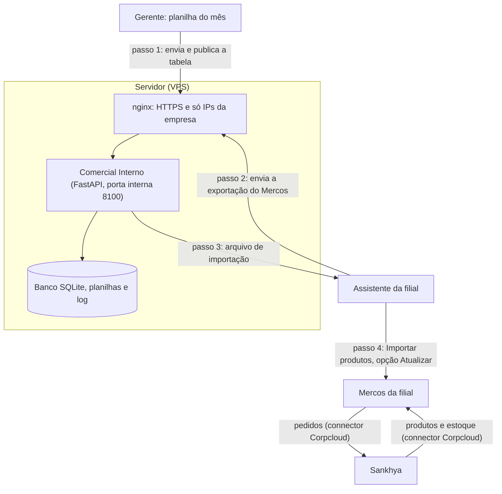

# Comercial Interno: tabelas de preço no Mercos, sem susto

App web interno que prepara a **importação de tabelas de preço no Mercos** para empresas que
integram **Sankhya × Mercos** pelo connector da **Corpcloud**: o gerente publica a tabela do mês,
cada assistente gera o arquivo da própria filial, e tudo fica registrado.

O objetivo é tirar do TI uma tarefa repetitiva e arriscada: **o gerente e as assistentes passam a
fazer a atualização de preços sozinhos**, com o app conferindo cada passo, e o TI só acompanha.


## O problema

Na integração Sankhya × Mercos, produtos, estoque e pedidos passam pelo connector, mas **o preço
não**: ele só entra no Mercos por importação de planilha. Toda mudança de tabela virava um trabalho
manual do TI, repetido **para cada filial** (cada filial é uma conta separada no Mercos):

1. receber a planilha do gerente e conferir se não há códigos repetidos com preços diferentes;
2. exportar os produtos do Mercos daquela filial;
3. cruzar as duas planilhas com PROCV, coluna por coluna (CIF, FOB, preço de tabela, preço mínimo);
4. limpar a exportação: centenas de linhas **sem código**, cadastros **duplicados**, linhas **ocultas
   por filtro**;
5. importar no Mercos da filial certa e conferir o resultado;
6. repetir tudo para a próxima filial.

Além de tomar tempo, o processo tinha armadilhas que só aparecem quando já deu errado:

| Armadilha | O que acontecia |
|---|---|
| PROCV arrastado só em parte | Os preços novos não entravam, sem nenhum aviso |
| Arquivo de uma filial importado em outra | O Mercos **criava produtos sem vínculo com o connector**: estoque parado e pedidos com "produto não integrado" |
| Linhas sem código na planilha | O Mercos criava cópias novas a cada importação (32 → 64 → 96 → 224) |
| Código com dois cadastros no Mercos | A importação **apagava as cópias** (com fotos) e criava um cadastro novo, sem vínculo |
| Colunas de estoque e NCM preenchidas | Estoque de uma filial gravado na outra; NCM apagado quando ia em branco |
| Várias versões da tabela do gerente | Ninguém sabia qual tinha sido usada em cada filial |

Um mês com vários desses erros ao mesmo tempo foi o que motivou o projeto.

## O que o app agiliza

| Antes | Com o app |
|---|---|
| O TI tratava as planilhas de **todas** as filiais a cada mudança de preço | O **gerente** publica a tabela e **cada assistente** importa a própria filial |
| PROCV e limpeza manuais, filial por filial | O app cruza, limpa e gera o arquivo em segundos |
| Erros descobertos dias depois, por pedidos que não integravam | O app **bloqueia** os erros conhecidos antes do arquivo existir |
| Conferência "de olho" | Resumo do que vai mudar, variações acima de 5% em destaque e o número exato que o Mercos deve mostrar antes de confirmar |
| "Quem mudou esse preço? Qual tabela foi usada?" | Log com quem publicou, quem importou, quando, de onde e com qual arquivo (SHA-256) |
| O TI no meio de todo o processo | O TI acompanha pela tela inicial (filial atrasada, importação não confirmada) e só atua nas exceções |

Na prática, a atualização de preços deixa de ser uma tarefa do TI e vira uma rotina do comercial,
feita por quem conhece os preços e com as travas que antes dependiam da experiência de quem fazia.

## Funcionalidades

- **Tabela do gerente por região:** o gerente envia a planilha, informa vigência e **desconto
  máximo** do vendedor, confere a variação contra a tabela anterior e publica. Códigos repetidos
  com preços diferentes são apontados antes da publicação.
- **Importação por filial:** a assistente envia a exportação do Mercos **da própria filial** e o app
  gera o arquivo de importação, com o resumo esperado do passo 3 do Mercos.
- **Limpeza automática:** linhas sem código, códigos com mais de um cadastro e produtos fora da
  tabela do gerente ficam **fora** do arquivo, cada um com o motivo.
- **Só o que muda:** o arquivo leva apenas os produtos cujo preço muda. Estoque vai em branco
  (o Mercos mantém o atual) e NCM, unidade, categoria etc. seguem exatamente como estão.
- **Regra de preço:** Preço de Tabela = CIF; Preço Mínimo = CIF menos o desconto máximo
  (configurável para usar o FOB); arredondamento comercial.
- **Travas contra os erros conhecidos:** exportação que parece de outra filial gera alerta;
  produto que não existe na filial nunca é criado pela planilha; confirmar a importação exige
  marcar a conferência do passo 3.
- **Log de auditoria completo:** logins (inclusive falhos), cada página, cada ação, IP e navegador;
  planilhas originais e geradas guardadas com **SHA-256**; exportação do log para Excel.
- **Saúde dos catálogos:** cada exportação vira uma "foto" do catálogo da filial (sem código,
  duplicados), para acompanhar se o lixo cresce.
- **Papéis e acesso:** administrador, gerente e assistente (só a própria filial). Filiais,
  regiões e usuários são cadastrados pela tela.
- **Backup e retenção:** cópia diária do banco e limpeza do que passou do prazo de guarda.

<table>
  <tr>
    <td></td>
    <td></td>
  </tr>
  <tr>
    <td align="center">Conferência da tabela do gerente</td>
    <td align="center">Arquivo gerado: próximo passo no Mercos</td>
  </tr>
  <tr>
    <td></td>
    <td></td>
  </tr>
  <tr>
    <td align="center">Início do administrador: pendências das filiais</td>
    <td align="center">Log de auditoria</td>
  </tr>
</table>

> Os prints usam **dados fictícios**. Eles são gerados por
> [`tools/gerar_prints_readme.py`](tools/gerar_prints_readme.py), que sobe o app num banco
> temporário com planilhas inventadas.

## Como funciona



O preço é a única coisa que **não** passa pela integração Sankhya × Mercos: ele entra no Mercos
por planilha. É essa etapa que o app cuida. Detalhes em [docs/INTEGRACAO.md](docs/INTEGRACAO.md).

| Peça | Papel |
|---|---|
| [`app/main.py`](app/main.py) | Rotas, telas, permissões e log de acesso |
| [`app/planilhas.py`](app/planilhas.py) | Leitura das planilhas, limpeza, preços e geração dos `.xlsx` |
| [`app/db.py`](app/db.py) | Esquema do banco SQLite |
| [`app/auditoria.py`](app/auditoria.py) | Registro de eventos e guarda de arquivos com SHA-256 |
| [`app/seguranca.py`](app/seguranca.py) | Senhas (PBKDF2), sessão, CSRF, IP real atrás do nginx |
| [`app/manutencao.py`](app/manutencao.py) | Backup diário e limpeza por prazo de guarda |
| [`app/templates/`](app/templates) | Telas (HTML com Jinja2) |

## Documentação

| Guia | Para quem | O que tem |
|---|---|---|
| [Integração Sankhya × Mercos](docs/INTEGRACAO.md) | TI, comercial | O que passa pelo connector, o vínculo do produto, como o Mercos trata a planilha, diagnóstico do "produto não integrado" |
| [Guia de uso](docs/USO.md) | Gerente, assistentes, admin | Passo a passo de cada papel, com prints |
| [Implantação](docs/IMPLANTACAO.md) | TI | Como o app foi instalado no aaPanel, do zero |
| [Operação](docs/OPERACAO.md) | TI | Atualizar, voltar versão, backup (Cron), liberar IP, logs, problemas comuns |
| [Segurança](docs/SEGURANCA.md) | TI | As camadas de proteção e por que cada uma existe |

## Rodar no computador (teste)

1. Instale o Python 3.12.
2. Dê duplo clique em [`iniciar_local.bat`](iniciar_local.bat) e abra http://127.0.0.1:8100.
3. A senha temporária do `admin` fica em `dados/SENHA_INICIAL_ADMIN.txt` (apague depois de trocar).
4. Cadastre em **Filiais** as regiões e as filiais, e em **Usuários** o gerente e as assistentes.

Os dados de teste ficam em `dados/`, que **nunca vai para o Git** (nem banco, nem planilhas, nem `.env`).

## Desenvolvimento

```powershell
pip install -r requirements.txt
pip install playwright; python -m playwright install chromium   # só para gerar os prints
python tools/gerar_prints_readme.py                              # regera docs/screenshots
```

Toda mudança de tela ou regra atualiza a documentação e os prints **no mesmo commit**.

## Autor

Desenvolvido por **Kevin Cristian** (TI), com apoio do Claude Code.
