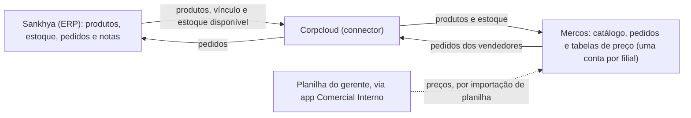

# Integração Sankhya × Mercos (connector Corpcloud)

Como os três sistemas conversam, o que **não** passa pela integração e o que fazer quando um pedido
não integra. Tudo aqui foi confirmado em produção (outubro/2026) com o suporte da Corpcloud, o suporte
do Mercos e testes reais.

## Os três sistemas



| Sistema | Papel |
|---|---|
| **Sankhya** | A fonte da verdade: cadastro de produtos (com NCM), estoque por empresa/local/lote, pedidos e nota fiscal |
| **Corpcloud** | O connector: vincula cada produto do Sankhya ao cadastro no Mercos, leva o estoque e traz os pedidos |
| **Mercos** | Onde os vendedores montam os pedidos. **Cada filial é uma conta independente**, com catálogo próprio |

## O que passa por onde

| Direção | O quê | Observação |
|---|---|---|
| Sankhya → Mercos | **Produtos** | Cadastrados no Sankhya e compartilhados pela integração; é aí que nasce o vínculo |
| Sankhya → Mercos | **Estoque** | O Mercos mostra o **disponível** = estoque − reservado. Atualiza ao longo do dia |
| Sankhya → Mercos | **Clientes** | Na implantação de referência, por um método customizado "sem contatos" |
| Mercos → Sankhya | **Pedidos** | Quando falha, o Mercos mostra "Não integrado – Verifique na integração (Connector)" |
| **Fora da integração** | **Preços** | CIF, FOB, preço de tabela e mínimo entram no Mercos **só por planilha**. O connector não sobrescreve o preço importado (testado) |
| **Fora da integração** | **NCM** | O connector não sincroniza. No Mercos é informativo; o que vale para a nota é o do Sankhya |

## O vínculo do produto

Para a integração funcionar, o produto precisa ter o **mesmo código** no Sankhya e no Mercos **e** um
**vínculo registrado no connector**. Código igual é necessário, mas não basta.

| Como o produto entrou no Mercos | Vínculo | Consequência |
|---|---|---|
| Cadastrado no Sankhya e compartilhado pela integração | Completo | Estoque atualiza sozinho, pedidos integram |
| **Criado por importação de planilha** (código que não existia na filial) | **Sem vínculo de estoque** | Estoque parado no número da planilha; pedidos com o item dão "produto não integrado" |
| Cadastro duplicado (mesmo código duas vezes) | Incerto | Vendedor pode escolher a cópia errada; planilha apaga as cópias e cria uma nova |

> **Regra:** produto novo nasce no **Sankhya** e vai para o Mercos **pela integração**. Nunca pela planilha.

## Como o Mercos trata a planilha ("Atualizar produtos")

Comportamentos confirmados pelo suporte do Mercos e em testes:

| Situação na planilha | O que o Mercos faz | O app |
|---|---|---|
| Código que já existe, uma vez | Atualiza o produto | É o que o app envia |
| "Quantidade em estoque" em branco | **Mantém** o estoque atual | Envia em branco |
| "NCM" em branco | **Apaga** o NCM do cadastro | Mantém o NCM que veio |
| Código que não existe na filial | **Cria** produto novo, sem vínculo | Nunca envia |
| Código com 2+ cadastros (inclusive inativos) | **Apaga todas as cópias** (com fotos) e cria uma nova: aparece no passo 3 como "substituirão outros existentes" | Deixa fora e avisa |
| Linha sem código | Cria um produto novo a cada importação (as cópias se multiplicam) | Nunca envia |
| Opção "Substituir" | Troca o catálogo inteiro pelo conteúdo da planilha | Instrução: nunca usar |

O Mercos **não tem** modo "só atualizar o que existe" nem inativação em massa: produtos sem código e
duplicados saem do catálogo manualmente.

### A conferência que evita problemas: o passo 3

Antes de clicar em **Confirmar importação** no Mercos, o resumo precisa mostrar exatamente
**0 novos · N atualizados · 0 substituirão outros · 0 excluídos**, com o N informado pelo app.
Qualquer número diferente: **Cancelar importação** e avisar o TI.

## Diagnóstico: "Produto não integrado"

1. **O produto foi criado por planilha naquela filial?** Na exportação do Mercos, produtos criados
   por planilha costumam aparecer no **fim da lista**. Se o mesmo código integra em outra filial, a
   suspeita fica forte.
2. **O estoque dele está congelado?** Compare o estoque do Mercos com o disponível no Sankhya (consulta
   abaixo). Mesmo número no Mercos por mais de um dia, enquanto o Sankhya muda = vínculo de estoque quebrado.
3. **Há cadastro duplicado?** Busque o código no Mercos da filial.
4. **Acione a Corpcloud** com código, empresa, números dos pedidos e a comparação de estoque. Ela refaz
   o vínculo buscando o produto direto do Sankhya.
5. **Corrija os pedidos que falharam**, depois do vínculo refeito: edite o pedido no Mercos, tire o
   produto sinalizado e coloque de novo; ou duplique o pedido e **cancele o original**.

Já descartados como causa nesse tipo de erro: produto inativo, falta de estoque, configuração do
produto no Sankhya (lote, local padrão) e a tabela de preço padrão da empresa (`TGFEMP.CODTAB`).

### Consultas no Sankhya (DBExplorer, um comando por vez, sem `;`)

Estoque disponível por produto (é o número que o Mercos deveria mostrar):

```sql
SELECT E.CODPROD, P.DESCRPROD,
       SUM(E.ESTOQUE) AS ESTOQUE, SUM(E.RESERVADO) AS RESERVADO,
       SUM(E.ESTOQUE) - SUM(E.RESERVADO) AS DISPONIVEL
  FROM TGFEST E
  JOIN TGFPRO P ON P.CODPROD = E.CODPROD
 WHERE E.CODEMP = 1
 GROUP BY E.CODPROD, P.DESCRPROD
 ORDER BY E.CODPROD
```

Estoque de um produto, lote a lote:

```sql
SELECT CODEMP, CODLOCAL, CODPROD, CONTROLE, ESTOQUE, RESERVADO, DTVAL
  FROM TGFEST
 WHERE CODEMP = 1
   AND CODPROD = 10001
 ORDER BY CONTROLE
```

## Quem resolve o quê

| Assunto | Quem |
|---|---|
| Vínculo de produto e de estoque, pedidos que não integram, logs da integração | **Corpcloud** |
| Importação por planilha, catálogo (duplicados, sem código), tabelas de preço | **Mercos** (o Mercos não guarda log da integração) |
| App Comercial Interno, consultas no Sankhya, primeiro contato | **TI** |

## Glossário

| Termo | Significado |
|---|---|
| **CIF** | Preço com o frete pago pela empresa até o cliente |
| **FOB** | Preço com o frete por conta do cliente |
| **Preço mínimo** | O menor preço que o vendedor consegue praticar no Mercos |
| **Vínculo** | Registro no connector que liga o produto do Sankhya ao cadastro no Mercos |
| **Disponível** | Estoque menos o reservado para pedidos não faturados |
| **Lote** | Cada fabricação do produto, com validade própria (`TGFEST.CONTROLE`) |
| **NCM** | Código de 8 dígitos que classifica a mercadoria para impostos. É do produto, igual em todas as empresas |
| **CODEMP** | Código da empresa no Sankhya |
| **TOP** | Tipo de operação no Sankhya (`CODTIPOPER`) |
