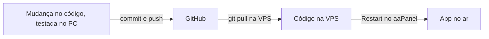

# Operação

Tarefas do dia a dia do TI com o app em produção. Os comandos rodam no **Terminal do aaPanel**
(o Linux da VPS, prompt `root@vmi...:~#`), **não** no PowerShell do Windows.

## Onde fica cada coisa

| Item | Caminho |
|---|---|
| Código (clone do GitHub) | `/www/wwwroot/comercialinterno` |
| Configuração de produção | `/www/wwwroot/comercialinterno/.env` |
| Banco, planilhas, backups | `/www/comercialinterno_dados` |
| Ambiente Python | `/www/server/pyporject_evn/comercialinterno_sys` |
| Log do processo do app | `/www/wwwlogs/python/comercialinterno/error.log` |
| Log de acesso do nginx | `/www/wwwlogs/comercialinterno.log` |
| Restrição de IPs | `/www/server/panel/vhost/nginx/extension/comercialinterno/restricao_ip.conf` |

## Atualizar o app (versão nova no GitHub)



```bash
cd /www/wwwroot/comercialinterno && git pull
```

Depois: **Website → Python Project → comercialinterno → Restart**.

- Na primeira vez pode aparecer `detected dubious ownership`: rode uma única vez
  `git config --global --add safe.directory /www/wwwroot/comercialinterno` e repita o `git pull`.
- Se a versão nova mudou o `requirements.txt`, instale antes do Restart:
  ```bash
  /www/server/pyporject_evn/comercialinterno_sys/bin/pip install -r /www/wwwroot/comercialinterno/requirements.txt
  ```
- Prefira atualizar fora do horário de uso das assistentes.

## Voltar uma versão (rollback)

**Pelo GitHub (recomendado):** desfazer a mudança com um novo commit (`git revert`), enviar, e na VPS
`git pull` + Restart. O histórico registra o que foi desfeito e por quê.

**Emergência, direto na VPS:**
```bash
cd /www/wwwroot/comercialinterno && git log --oneline -5   # ver as versões
git checkout <codigo-da-versao-boa>                          # ex.: git checkout 3b7d3ad
```
Restart no aaPanel. Para sair da emergência depois da correção: `git checkout main && git pull` + Restart.

> O código volta pelo Git; **os dados não**. Se uma versão mudou a estrutura do banco, voltar só o
> código pode não bastar: restaure também o backup do banco (abaixo).

## Backup diário (Cron)

O banco (`precos.db`) guarda usuários, filiais, todas as tabelas publicadas, todas as importações e o
log. O GitHub guarda só o código. O comando de manutenção do app faz três coisas: copia o banco para
`backup/` (guarda os 30 últimos), apaga logs e planilhas além do prazo de guarda e registra o espaço
livre em disco.

No aaPanel: **Cron → Add Task**
- **Type:** Shell Script
- **Name:** `comercialinterno - backup diario`
- **Period:** Daily, 03:00
- **Script:**
  ```bash
  cd /www/wwwroot/comercialinterno && sudo -u www /www/server/pyporject_evn/comercialinterno_sys/bin/python -m app.manutencao
  ```

Para testar na hora, use **Execute** na tarefa e veja o log dela. O backup aparece em
`/www/comercialinterno_dados/backup/precos_AAAA-MM-DD_HHMM.db`.

> O backup fica **na mesma VPS**: protege contra erro e arquivo estragado, não contra perder o servidor.
> Para isso, use os snapshots da Contabo ou copie a pasta `backup/` para fora periodicamente.

### Restaurar um backup

1. Website → Python Project → comercialinterno → **Stop**.
2. ```bash
   cd /www/comercialinterno_dados
   cp precos.db precos_antes_da_restauracao.db
   cp backup/precos_2026-10-07_0300.db precos.db && chown www:www precos.db
   ```
3. **Start** no aaPanel.

## Liberar um IP novo

Sintoma: todo mundo da empresa recebe **403 Forbidden** (o provedor trocou o IP). Descubra o IP atual
abrindo `https://api.ipify.org` num computador da empresa, edite `restricao_ip.conf` trocando ou
acrescentando a linha `if ($remote_addr = X.X.X.X) { set $ci_bloqueado 0; }` e aplique:

```bash
/www/server/nginx/sbin/nginx -t && /www/server/nginx/sbin/nginx -s reload && echo "NGINX RECARREGADO"
```

O `-t` testa antes: se houver erro de digitação, nada é aplicado e os outros sites seguem no ar.

## Senha do admin perdida

Outro administrador gera uma **nova senha** na tela Usuários. Se não houver outro admin:

```bash
cd /www/wwwroot/comercialinterno && sudo -u www /www/server/pyporject_evn/comercialinterno_sys/bin/python - <<'EOF'
from app import db, seguranca
nova = "TroqueEsta12345"
db.executar("UPDATE usuarios SET senha_hash = ?, trocar_senha = 1, ativo = 1 WHERE login = 'admin'",
            (seguranca.gerar_hash(nova),))
print("senha temporária do admin:", nova)
EOF
```

## Problemas comuns

| Sintoma | Causa provável | O que fazer |
|---|---|---|
| **403 Forbidden** para todos | IP da empresa mudou | "Liberar um IP novo" |
| **403** só de casa | Esperado: acesso só pela rede da empresa | Usar na empresa (ou VPN) |
| **502 Bad Gateway** | App parado | Website → Python Project → Start; ver o log do processo |
| Login não funciona, sem erro | Acesso por `http://` | Usar `https://` (o cookie de login só vale em HTTPS) |
| "Formulário expirado" | Página aberta antes de um Restart | Recarregar a página e repetir |
| App não sobe, log com `Permission denied` | Ambiente Python sem permissão para o usuário `www` | Ver a nota sobre o "pyenv" em [IMPLANTACAO.md](IMPLANTACAO.md) |
| Tabela recusada: "fórmulas sem valor calculado" | Planilha com PROCV para outro arquivo, salva sem calcular | Abrir no Excel, calcular, salvar e reenviar |
| Passo 3 do Mercos com "substituirão" ou "novos" | Cadastro duplicado/inexistente no Mercos | **Cancelar** no Mercos; ver [INTEGRACAO.md](INTEGRACAO.md) |

## O que NÃO fazer na VPS (compartilhada)

- Não atualizar/reinstalar nginx, PHP ou MySQL pelo aaPanel.
- Não usar Docker (mexe no firewall do servidor).
- Não abrir a porta 8100 no firewall.
- Não usar o "pyenv (aaPanel env)" para o app (é o Python do painel).
- Não rodar `do-release-upgrade` nem reiniciar sem janela de manutenção e snapshot.
