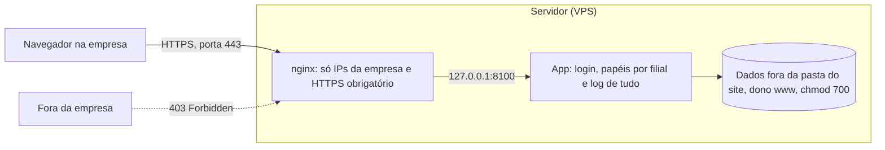

# Segurança

O app guarda preços, margens e o histórico comercial. A proteção é em camadas: se uma falhar,
as outras continuam valendo.

## 1. Só a rede da empresa (allowlist de IP no nginx)

Todos os computadores do escritório saem para a internet por um mesmo **IP público**. O nginx compara
o IP de quem chega com a lista; quem não está nela recebe **403 Forbidden** e nem vê a tela de login.

- A regra fica num arquivo de **extensão** do site
  (`/www/server/panel/vhost/nginx/extension/comercialinterno/restricao_ip.conf`), que o aaPanel não
  sobrescreve ao renovar o certificado.
- O caminho `/.well-known/acme-challenge/` fica aberto: é por ele que o Let's Encrypt renova o certificado.
- O app escuta só em `127.0.0.1:8100` e a porta 8100 está **fechada** no firewall: não dá para
  "pular" o nginx.

Limites: qualquer pessoa no Wi-Fi da empresa passa por essa camada (por isso existe o login); de casa
não funciona (precisaria de VPN); se o provedor trocar o IP, todos recebem 403 (ver
[OPERACAO.md](OPERACAO.md#liberar-um-ip-novo)).

## 2. HTTPS obrigatório

**HTTP** é um cartão-postal: usuário, senha e preços trafegam abertos e podem ser lidos ou alterados
no caminho (Wi-Fi, provedor). **HTTPS** é uma carta lacrada: tudo criptografado, e o certificado prova
que o site é mesmo o da empresa.

| Proteção | Efeito |
|---|---|
| Certificado Let's Encrypt | Criptografia; renovação automática pelo aaPanel |
| Force HTTPS | Quem digita `http://` é redirecionado para `https://` (301) |
| HSTS (`Strict-Transport-Security`) | O navegador lembra por 1 ano que o site é só HTTPS |
| Cookie `Secure; HttpOnly; SameSite=Lax` | O login só funciona em HTTPS e o cookie não é lido por scripts |

## 3. Login individual

- Senhas guardadas com **PBKDF2-SHA256** (240 mil iterações), nunca em texto.
- Senha temporária gerada pelo admin, **troca obrigatória** no primeiro acesso, mínimo de 10 caracteres
  com letras e números.
- **10 tentativas erradas** do mesmo IP em 15 minutos bloqueiam novas tentativas.
- Sessão expira em 10 horas. Proteção **CSRF** em todos os formulários.

## 4. Papéis e escopo

| Papel | Escopo |
|---|---|
| Assistente | Só a própria filial: não vê nem baixa arquivos de outra filial |
| Gerente | Tabelas de preço; não acessa importações |
| Administrador | Tudo |

Tentativas de acesso fora do papel geram **403** e ficam no log como "negado".

## 5. Log de auditoria

Cada login (com motivo da falha), página acessada, ação, erro e alteração de cadastro/configuração,
com usuário, data/hora, **IP real** (vindo do nginx via `X-Real-IP`) e navegador. Planilhas enviadas
e geradas ficam guardadas com **SHA-256**, que prova que o arquivo não mudou depois. A tela de login
avisa que os acessos são registrados (transparência/LGPD). Retenção padrão: 5 anos.

## 6. Dados e segredos fora do Git

- `.gitignore` bloqueia banco, planilhas, `.env` e backups. Nenhum dado comercial vai para o GitHub.
- Na VPS, o código fica em `/www/wwwroot/comercialinterno`; os dados em `/www/comercialinterno_dados`,
  **fora da pasta do site**, dono `www`, `chmod 700`.
- A chave das sessões (`APP_SEGREDO`) foi gerada na própria VPS e fica só no `.env` (`chmod 600`).
- A VPS lê o repositório privado com uma **deploy key somente leitura**, válida só para este repositório.
- O app roda como usuário **`www`**, não como root.

## Termos usados

| Termo | Em uma frase |
|---|---|
| **FastAPI** | Biblioteca Python para construir sistemas web; o app usa para as telas e rotas |
| **uvicorn** | O "motor" que mantém o app ligado, recebendo os pedidos |
| **nginx** | O servidor que recebe todos os acessos da VPS e encaminha para cada site |
| **Porta** | O "número da sala" num endereço: 443 é o HTTPS do nginx, 8100 é a sala interna do app |
| **Allowlist** | Lista do que é permitido; o resto é bloqueado |
