# Guia de uso

Passo a passo de cada papel. Os prints usam dados fictícios.

| Papel | Pode |
|---|---|
| **Gerente** | Enviar, conferir e publicar as tabelas de preço |
| **Assistente** | Importar **só na própria filial**: enviar a exportação do Mercos, revisar, gerar, baixar e confirmar |
| **Administrador** | Tudo, mais filiais, usuários, configurações, log e saúde dos catálogos |

Todo usuário entra com login próprio. No primeiro acesso, o app obriga a trocar a senha temporária
(mínimo de 10 caracteres, com letras e números). Depois de 10 senhas erradas seguidas, o acesso
daquele computador fica bloqueado por 15 minutos.

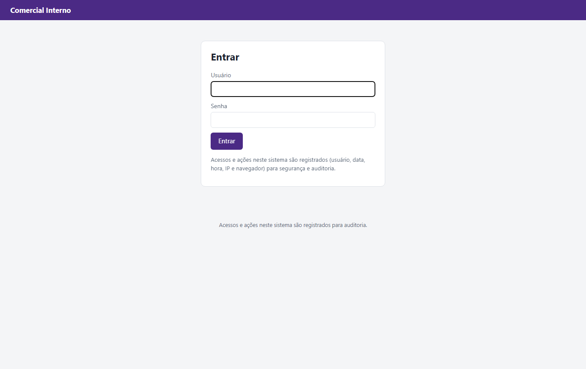

---

## Gerente: publicar a tabela do mês

1. Menu **Tabelas de preço** → **Enviar nova tabela**.
2. Escolha a **região** (a lista começa vazia, de propósito), a **vigência** (a partir de quando vale) e o **desconto máximo** do vendedor.
   O desconto é obrigatório: ele define o Preço Mínimo no Mercos (CIF − desconto).
3. Escolha a planilha `.xlsx` e clique em **Conferir tabela**. A tabela fica em **rascunho**.
4. Confira a tela:
   - **"Vale para"**: a região escolhida e a lista das filiais que vão receber estes preços. Se não for
     isso, descarte o rascunho e envie de novo com a região certa. Região sem filial aparece em vermelho;
   - como o app leu a planilha (aba, linha do cabeçalho, colunas de código, CIF e FOB);
   - **códigos repetidos com preços diferentes** (bloco vermelho): o ideal é corrigir a planilha e
     enviar de novo; se publicar assim, esses códigos ficam fora e mantêm o preço atual no Mercos;
   - a **comparação com a tabela anterior**: preços que mudaram (variações acima de 5% em destaque),
     produtos novos e produtos que saíram.
5. Marque a confirmação **"Confirmo publicar para SP — São Paulo: ..."** (com os nomes das filiais) e clique em
   **Publicar tabela**. Ela passa a valer para essas filiais e substitui a anterior da região. As filiais
   confirmadas ficam registradas no log.

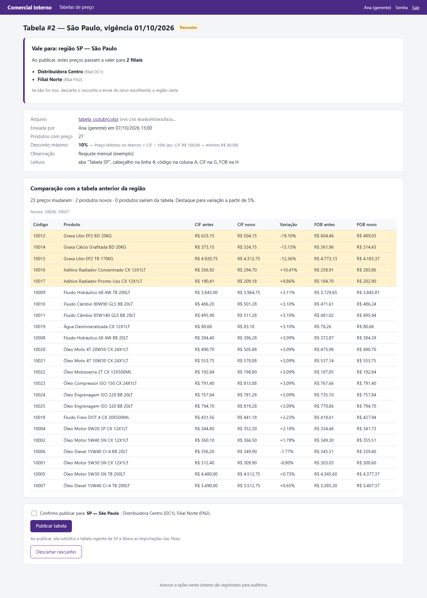

> A planilha precisa ter os valores calculados. Se ela tiver fórmulas ligadas a outro arquivo
> (PROCV de outra planilha), abra no Excel, deixe calcular e salve antes de enviar; senão o app recusa
> com "preços são fórmulas sem valor calculado".

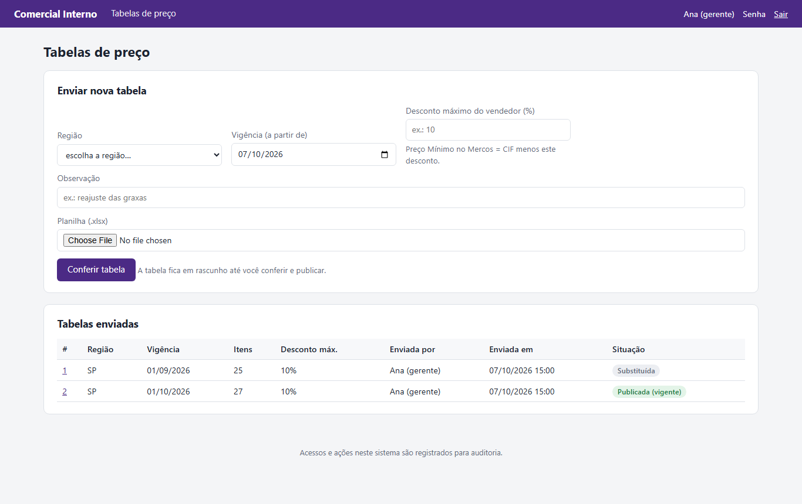

---

## Assistente: importar os preços na filial

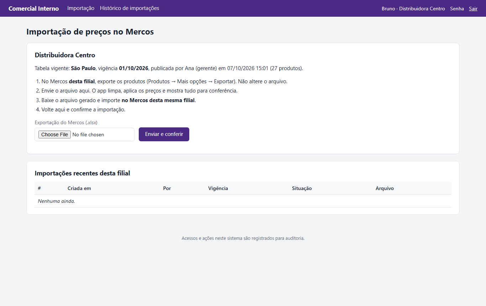

1. No **Mercos da sua filial**: Produtos → Mais opções → **Exportar**. Não altere o arquivo.
2. No app, menu **Importação** → envie o arquivo → **Enviar e conferir**.
3. Revise a conferência:
   - **Resultado:** quantos produtos vão no arquivo, quantos preços mudam, variações acima de 5%, e
     produtos da tabela que não existem na filial;
   - **Limpeza:** produtos sem código e códigos com mais de um cadastro **ficam fora** do arquivo
     (eles precisam ser resolvidos no próprio Mercos);
   - **Avisos:** cadastros com nome trocado, duplicados a inativar;
   - **Preços alterados:** antes e depois, com as maiores variações no topo.
4. Clique em **Gerar arquivo de importação**.

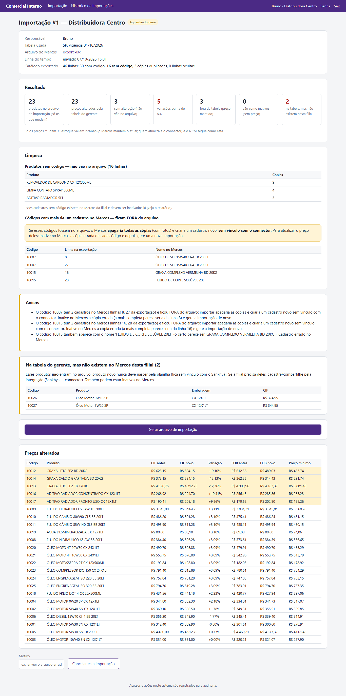

5. No quadro roxo, **baixe o arquivo** e importe no Mercos **da mesma filial**:
   Produtos → **Importar produtos** → escolha o arquivo → **"Atualizar produtos"** (nunca "Substituir").
6. **Antes de confirmar no Mercos**, confira o resumo do passo 3. Tem que estar exatamente como o app
   mostra (ex.: **0 novos · 23 atualizados · 0 substituirão outros · 0 excluídos**). Diferente disso,
   **Cancelar importação** no Mercos e avise o TI.
7. Volte ao app, marque as duas caixas (passo 3 conferido e importação concluída) e clique em
   **Confirmar importação**. Se cancelou no Mercos, use **Cancelar esta importação** no fim da página.

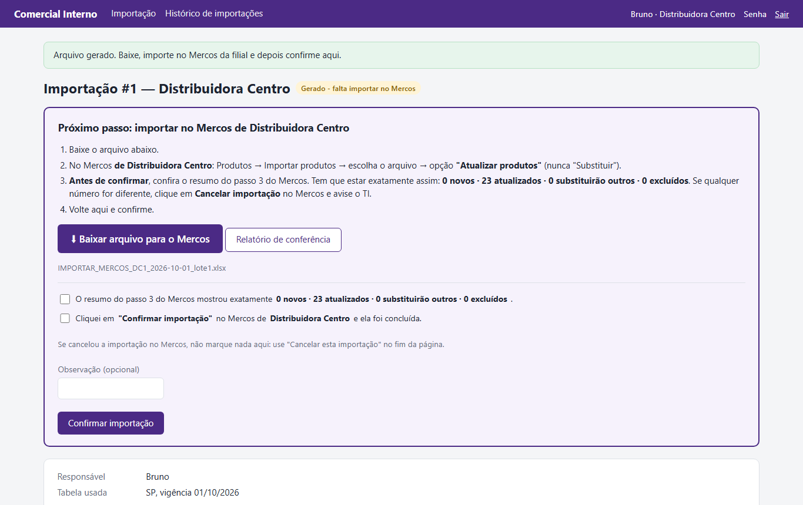

> **Nunca** use o arquivo de uma filial em outra: o Mercos cria os produtos que não existem lá, sem
> vínculo com o connector. Se a exportação parecer de outra filial, o app avisa e pede confirmação.

O relatório de conferência (`.xlsx`) traz as abas: Resumo, Preços alterados, Fora da tabela,
Sem alteração, Limpeza, Cadastrar no Sankhya e Avisos.

---

## Administrador

### Tela inicial: pendências

Mostra a situação de cada filial (tabela vigente, última importação, "em dia" ou "falta importar")
e os **pontos de atenção**: filial que não importou a tabela vigente, arquivo gerado e não confirmado
há mais de um dia, falhas de login ou erros nas últimas 24 horas.

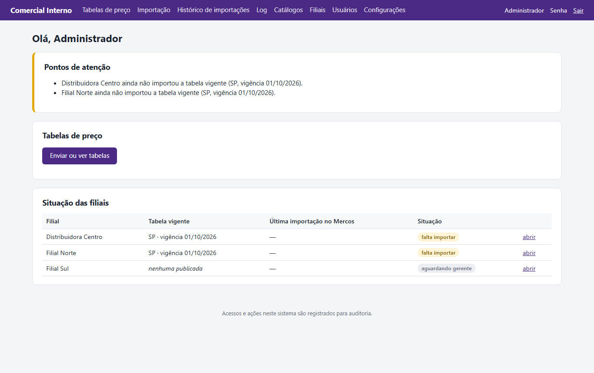

### Filiais e regiões

- **Região** = grupo de filiais que usa a **mesma tabela de preço** (ex.: SP, PR). O gerente publica
  uma tabela por região.
- **Filial** = uma **conta do Mercos**. Tem código, nome como aparece no Mercos e região.
- **Região não é filial.** Exemplo: região **SP** (tabela de São Paulo) com as filiais 9 e 15; região **PR**
  (tabela do Paraná) com a filial 18.
- Dica: use como código da filial o número da empresa no Sankhya (CODEMP).
- **Excluir** só aparece para o que nunca foi usado: região sem filiais e sem tabelas; filial sem
  importações e sem assistentes. O resto se **desativa** (filial) ou se **renomeia** (região), para não
  perder histórico. Trocar a região de uma filial é imediato. Tudo fica no log.
- Ordem do primeiro cadastro: regiões → filiais → usuários.

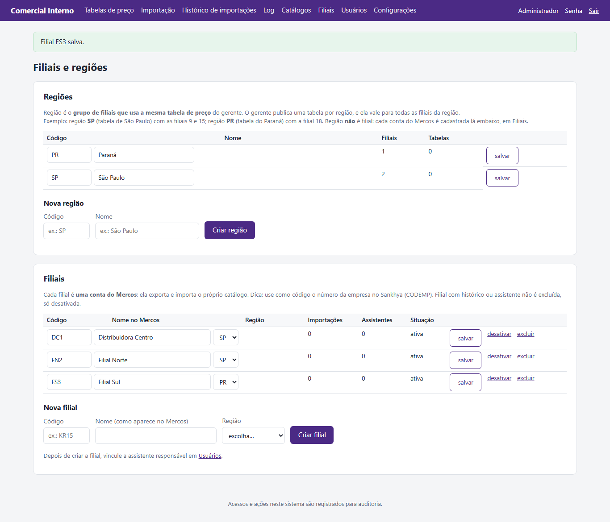

### Usuários

Criar (login, nome, papel e, para assistente, a filial), gerar **nova senha** temporária, trocar
papel/filial, desativar. A senha temporária aparece **uma única vez**: passe à pessoa por um canal seguro.

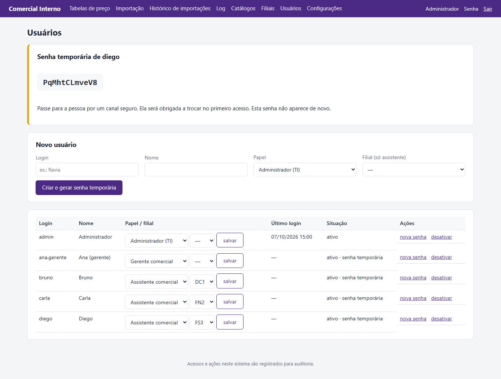

### Log de auditoria

Filtros por usuário, tipo, ação, IP e período; "só falhas"; "incluir acessos de página";
**Exportar Excel**. Cada evento tem os detalhes (antes/depois de alterações, motivo de recusa, hash
dos arquivos baixados).

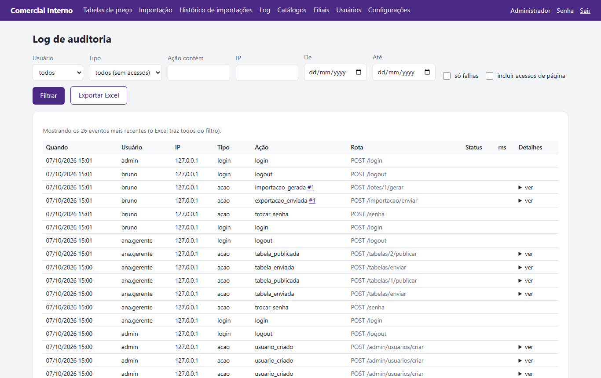

### Catálogos

Cada exportação enviada vira uma "foto" do catálogo da filial: linhas, com código, **sem código**,
**cópias duplicadas**, ocultas. Se esses números crescem, tem cadastro sendo criado fora do connector.

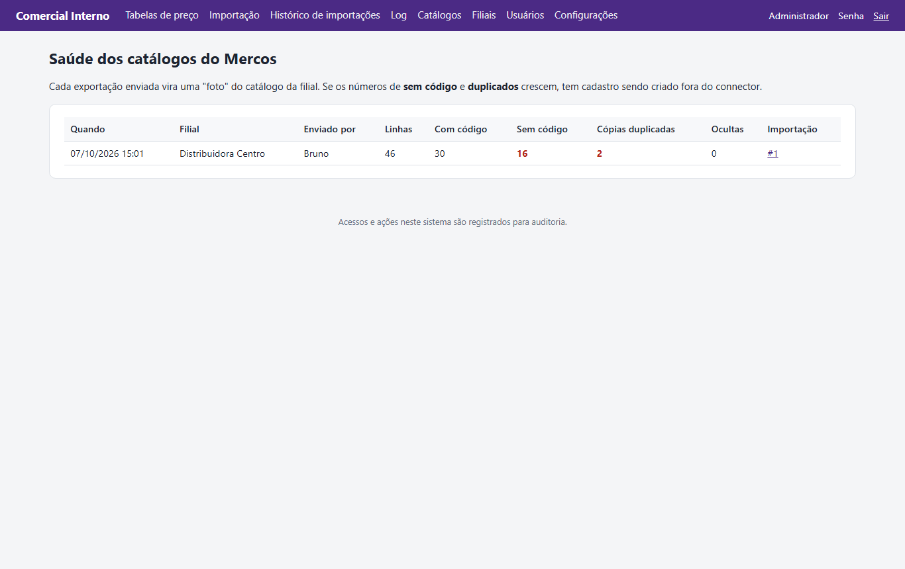

### Configurações

- **Destacar variação a partir de (%)** — padrão 5%.
- **Preço mínimo no Mercos** — CIF menos o desconto máximo da tabela (padrão) ou FOB da tabela.
- **Guardar logs e arquivos por (anos)** — padrão 5.

Toda alteração vai para o log com o valor antigo e o novo.
